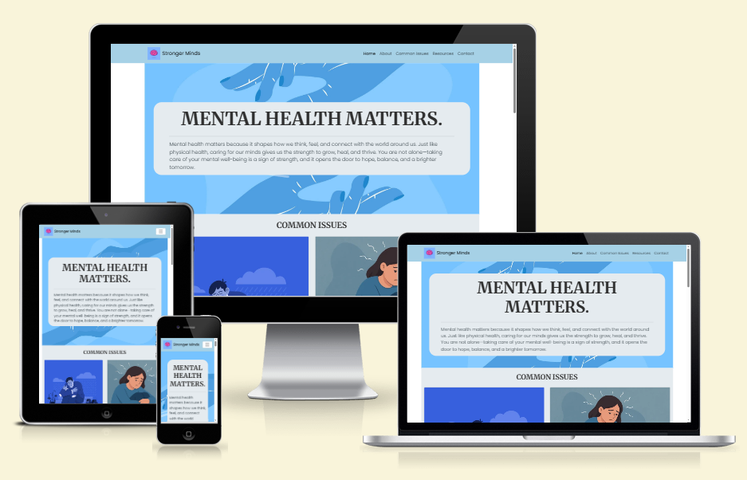
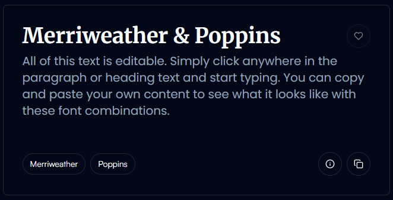
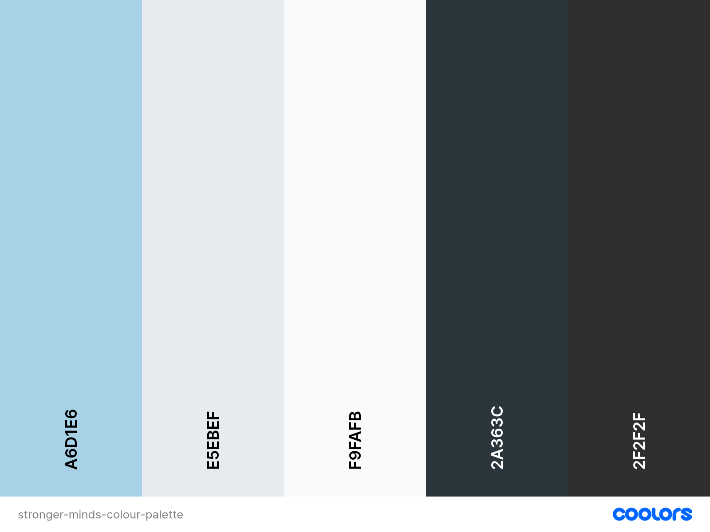
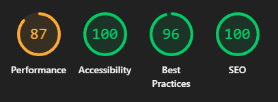
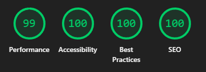
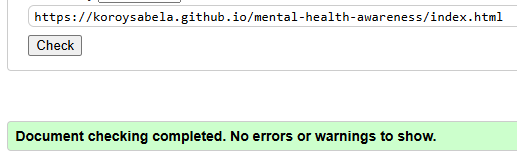
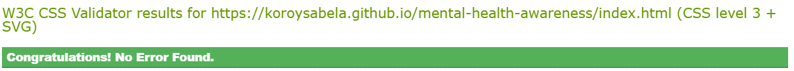
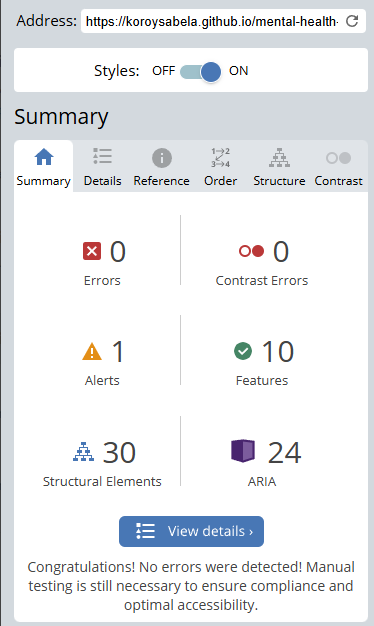

# Code Institute - AI Augmented Fullstack Bootcamp - Individual Flagstone Project
## HTML/CSS/Individual Project - Mental Health Awareness

## Table Of Contents:
1. [Description](#description)

2. [Design and Planning](#design-and-planning)
    * [Typography](#typography)
    * [Colour Scheme](#colour-scheme)
    * [Images and Icons](#images-and-icons)
    
3. [Features](#features)
4. [Technologies Used](#technologies-used)
4. [AI](#ai)
5. [Testing](#testing)
6. [Bugs](#bugs)
7. [Deployment](#deployment)
8. [Credits](#credits)

## Description:

**Stronger Minds** - is dedicated to raising mental health awareness, providing resources, support, and practical tips to help individuals thrive. Discover information on common issues, access helpful links, and find encouragement for your mental well-being.

It is a single page website created using HTML, CSS and Bootsrap (Ver 5.3.7).

## Design and Planning:

### Typography:
[fontpair](https://www.fontpair.co/) was used to find different pairings of font to see what would look good together.

Merriweather was chosen for readability in heading elements, and Poppins for a slight gentleness.

[Google fonts](https://fonts.google.com/) was then used to import the fonts into the CSS file.

### Colour Scheme:
ChatGPT was used to help come up with different types of themes for a mental health awareness website. The general color scheme of the decided is of light blue-ish/grey tones as shown in this screenshot:

However, some additional colours may come from the images, as mentioned in the Images & Icons section below.

### Images and Icons:
Images, Icons and Logos used in the website were either generated usingChatGPT or taken from existing AI images on [Freepik](https://www.freepik.com/).

## Features:
Current features:
- Navbar (working same page links)
- Hero / About section
- Common Issues section + Tips
- Resources section
- Quotes section
- Contact us section (Form layout only)
- Footer (with links to social media pages - only homepage)

Future features:
- Navbar - collapse when pressing/clicking away (needs JS)
- Contact us section - with success page
- Resources - more links

## Technologies Used:
The main technologies used to create this project are:
- HTML
- CSS
- Bootstrap - Ver 5.3.7
- Git 
- Github

Other Tools / Technologies:
- [Google fonts](https://fonts.google.com/)
- [Fontawesome](https://fontawesome.com/)
- [imagecolorpicker](https://imagecolorpicker.com/)
- [coolors.co](https://coolors.co/)
- [fontpair](https://www.fontpair.co/)
- [Freepik](https://www.freepik.com/)
- [tinyjpg](https://tinyjpg.com/)
- [freeconvert](https://www.freeconvert.com/)
- [favicon.io](https://favicon.io/)
- [Adobe Express resizer](https://www.adobe.com/express/feature/image/resize)
- [Markdown](https://www.markdownguide.org/)

## AI
The most significant use of AI was through the creation of [images](#images-and-icons), initial designing of the [colour palette.](#colour-scheme), and the text content used for the website. This was done in order to focus on building a website through what has been taught and to prevent too much time being spent on looking for content to use.

Github Copilot (connected with VSCode) was also used to help with debugging or adding quick lines/fixes of code in HMTL or CSS, to help prevent spending a lot of time on small things.

## Testing
### Google's Lighthouse Performance
The page was tested in incognito mode in Google Chrome.

Mobile:

The performance in mobile is slightly lower than what I would've wanted, this is most likely dues to image sizes.

Desktop:

### Code Validation
[HTML Validation](https://validator.w3.org/)

[CSS Validation](https://jigsaw.w3.org/css-validator/)

### WAVE Acessibility
[WAVE - Web Accessibility Evaluation Tool](https://wave.webaim.org/)

## Browser Compatability
The has been run on Google Chrome, Microsoft Edge and Mozilla Firefox. All which seem to run well.

## Bugs
Currently known: 
- non-breaking bugs:
    - Quotes carousel uses text based quotes, so it looks slightly glitchy/jittery when changing. Most specifically for quotes that are slightly longer. Easy fix would be to just used image based quotes of the same sizes.

Throughout development:
- Fixed:
    - Margin and padding issues in different screen sizes, fixed along the way when creating site.

## Deployment
Early deployment of the site was done for ease of development as the project progressed.
#### Deloying on Github:
The site was deployed to Github Pages using the following method:
- Go to the Github repository.
- Navigate to the 'settings' tab.
- Got to Pages > Build and deployment
- Make sure Source is set to 'Deploy from a branch"
- In Branch, dropdown menu, choose 'main'.
- Click 'save'.
- Refresh the page.
- Click the 'Visit site' which will open the deployed page in a new tab. (This may take a few minutes).
### View the deployed site:
View the deployed [site.](https://koroysabela.github.io/mental-health-awareness/index.html)

## Credits
- [Code Institute](https://codeinstitute.net/) - Great teaching and content, experience on this first project was amazing! Looking forward to more. 

### Resources used for help:
- Other resouces used have been linked throughout this readme.
- [Stackoverflow](https://stackoverflow.com/) - Amazing site for quick 
- [ByteGrad](https://www.youtube.com/@ByteGrad) - Youtube channel which helped me find quick fixes to issues in Bootstrap.
